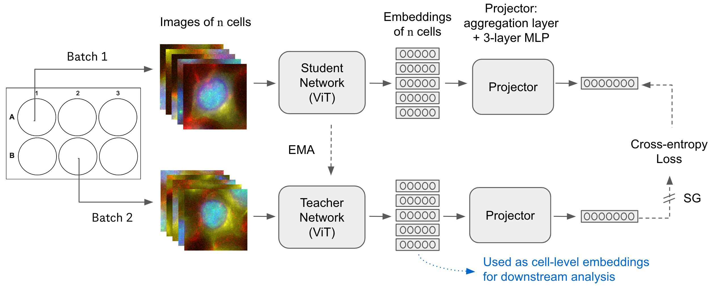
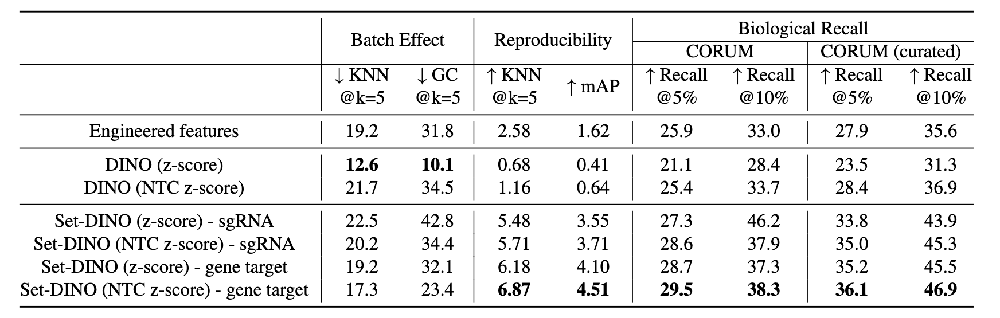
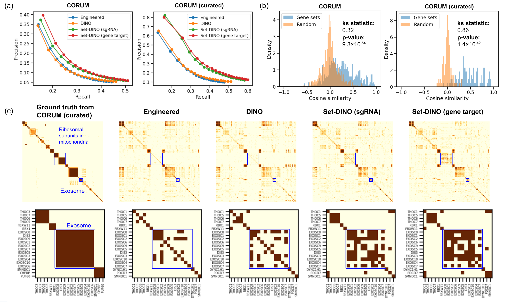

# Set-DINO for Single-Cell Morphological Profiling

Official PyTorch implementation and pretrained models for Set-DINO. For details, see the paper: **Weakly Supervised Set-Consistency Learning Improves Morphological Profiling
of Single-Cell Images**.

[[`arXiv`](https://arxiv.org/abs/2406.05308)]

## Set-DINO

Set-DINO is a set-level consistency learning algorithm that combines self-supervised learning with weak supervision and set-level representation
to improve learned representations of perturbation effects in single-cell images.

Key features of Set-DINO include:
1. Biological replicates across batches are used as weak supervision to encourage the SSL model to learn representation that are less confounded by **batch effects**.
2. Instead of using a single-cell image as input, we sample a set of single-cell images with the same perturbation to overcome the **heterogeneity** of single-cell data.

We trained the model on a public OPS dataset from [Funk, et al.](https://pubmed.ncbi.nlm.nih.gov/36347254/) Our results show that Set-DINO helps mitigate the impact of confounders and encodes more biologically meaningful information.

### Framework Overview


### Performance Comparison
Set-DINO outperforms engineered features and the regular DINO framework on single-cell images. The embeddings from Set-DINO recall more known relationships in the CORUM dataset. 
More discussion can be found in the **Results and Discussion** section of the paper. 





## Installation

```bash
$> conda env create -f environment.yaml
$> conda activate set-dino
```

## Pretrained Models
A pretrained `vit_small` checkpoint is provided at `./checkpoint/pretrained_cross_batch_n16_guide0_ntc_norm.ckpt`.
This checkpoint was used to generate the results of `Set-DINO (z-score) - gene target` shown above.

In the training process of the provided checkpoint, the teacher
and student views are sampled from cells (n=16) with the same gene targets (multiple guide RNAs) and from different batches. 
The full training hyperparameters can be found at `./run-experiment.sh`

## Run Inference
To properly run the inference with the pretrained model, the input high-content images should have the same four channels as the training data: 
DNA damage, F-actin, DNA, and microtubules. Example image data are located at `./example_data/images`

### Use the Jupyter Notebook
Examples of using the pretrained models can be found at `./run_inference_on_Example_images.ipynb`.

### Use the Python Script
```bash
$> python run_inference.py --output_dir  ...
```
An LMDB database for images and a dataframe for metadata are required. Detailed information on the dataset configuration can be found in the next section.

## Train Your Own Model

### Dataset Preparation
The single-cell data from high-content screening should be organized into two files:

* **A dataframe for metadata**: We use a dataframe (stored as a parquet file) to store the metadata of detected cells in the whole high-content screening experiment. Each row provides the metadata of a single cell.
**An example** of the metadata file is given at: `./example_data/metadata.parquet`. The required fields of the dataframe include:
  * `gene`: Gene target (gene symbol) of the perturbation introduced to the cell.
  * `guide`: Identifier of the guide that was introduced to the cell.
  * `plate`:  Identifier of the plate where the cell is from.
  * `well`: Identifier of the well where the cell is from.
  * `tile`: Multiple images may be captured for one well. The tile id indicates which image the cell is from.


* **An LMDB database for single-cell images**: 
[LMDB](https://lmdb.readthedocs.io/en/release/) (Lightning Memory-Mapped Database) is a high-performance, memory-efficient database with an ordered-map interface.
It is used to store and access single-cell images efficiently. Using LMDB, we store individual single-cell images in a (key, value) pair. 
To properly use dataset classes defined in `dataset.py`, the keys should be organized in a format as `{gene};{guide};{plate};{well};{tile};{df_idx}`, 
where `gene`, `guide`, `plate`, `well`, `tile` are metadata of the corresponding single-cell image provided in the metadata dataframe, 
and `df_idx` is the index of the corresponding row in the metadata dataframe. The single-cell images should have already undergone regular preprocessing steps such as 
illumination correction, and percentile normalization. The intensity of the single-cell images are expected to range from [0, 1] in `np.float32`.
**An example** of the LMDB database is given at: `./example_data/lmdb_dataset`.


### Model Training
1. Set up configurations in `constants.py`, which provides information on train/val/test data split, the identifier of the non-targeting cells, 
mapping of the columns names in the metadata file, and the gene subset used for calculating validation metrics during the model training.

2. Update the input data paths and output directory in `run-experiment.sh`. Change the hyperparameters as needed.

3. Run `bash run-experiment.sh`


## Contact
If you have any questions, please feel free to open an issue or email [yao.heming@gene.com](mailto:yao.heming@gene.com) and [richmond.david@gene.com](mailto:richmond.david@gene.com).

## License
This repository is released under the Apache 2.0 license as found in the [LICENSE](License.txt) file.

## Citation
If you find this repository useful, please consider giving a star and citing the work using this BibeTeX:
```
@inproceedings{yao2024setdino,
  title={Weakly Supervised Set-Consistency Learning Improves Morphological Profiling of Single-Cell Images},
  author={Yao, Heming and Hanslovsky, Phil and Huetter, Jan-Christian and Hoeckendorf, Burkhard  and Richmond, David},
  booktitle={Proceedings of the IEEE/CVF Conference on Computer Vision and Pattern Recognition (CVPR) Workshops},
  month={June}
  year={2024}
}
```
